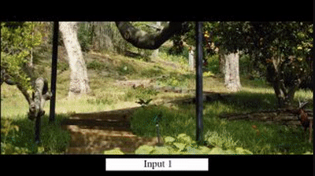

# Extreme View Synthesis

<p align="center">
  </p>

#### [Paper](https://arxiv.org/abs/1812.04777) | [Extended Presentation at GTC 2019](https://developer.nvidia.com/gtc/2019/video/S9576) (requires free registration) | [Latex citation](#citation)

Code for the paper:  
**Extreme View Synthesis**  
[Inchang Choi](http://www.inchangchoi.info/), [Orazio Gallo](http://alumni.soe.ucsc.edu/~orazio/), [Alejandro Troccoli](https://research.nvidia.com/person/alejandro-troccoli), [Min H. Kim](http://vclab.kaist.ac.kr/minhkim/) and [Jan Kautz](http://jankautz.com/), IEEE International Conference on Computer Vision, 2019 (Oral).


## License

Copyright (C) 2019 NVIDIA Corporation.  All rights reserved.

Licensed under the [NVIDIA Source Code License](LICENSE.md)

## Pre-requisites

For convenience, we provide a Dockerfile to build a container image to run the code. The image will contain the Python dependencies and a build of COLMAP.

Your system will need:

1. [NVIDIA Docker](https://github.com/NVIDIA/nvidia-docker/wiki)

2. NVIDIA GPU driver 418 or later.

Build the container image:

```
docker build -t xtreme-view .
```

## Download the models and sample data

You can download the models and the sample data from the NVIDIA GPU CLOUD registry using the provided scripts:


```
./download_model.sh
```

Please contact the authors about availability of the sample data. If you have your own sequence of images, you can create a directory tree with root ```data```, followed by a directory per sequence, e.g. ```data/0000```, and place all images in the sequence into the ```data/0000/images``` sub-directory.


After downloading the models and acquiring data, you should have a ```models``` and a ```data``` folders.

## Running the code


Launch the container using the provided script:

```
./launch_container.sh
```

Run COLMAP on a sequence of images to get the camera parameters:

```
./run_colmap.sh /data/0000
```

Run the extreme view code generation:

```
python run_xtreme.view.py /data/0000 --input_views=6,8
```

This will run the extreme view synthesis code using images 6 and 8 of the sequence /data/0000. The virtual camera locations are set in the code that match those we used in the paper. You can modify the code to use different virtual cameras.

You can run COLMAP and the extreme view synthesis on all the sample sequences:

```
./run_colmap_all.sh
./run_xtreme_view_all.sh
```

The results are stored in the sequence directory under ```xtreme-view```. For example, for ```data/0000``` you will find the results in the directory ```data/0000/xtreme-view```. The initial view synthesis is located under ```output``` and the the refined one under ```refinement```.

## <a name="citation"></a> Citation
If you find this code useful in your research or fun project, please consider citing the paper:
```
@inproceedings{extremeview,  
  title={Extreme View Synthesis},  
  author={Choi, Inchang and Gallo, Orazio and Troccoli, Alejandro and Kim, Min H and Kautz, Jan},  
  booktitle={Proceedings of the IEEE International Conference on Computer Vision},  
  pages={7781--7790},  
  year={2019}  
}
```

## Open Source licenses

DeepMVS is Copyright (c) 2018, Po-Han Huang, distributed under the [BSD 2-clause license](https://opensource.org/licenses/BSD-2-Clause)
